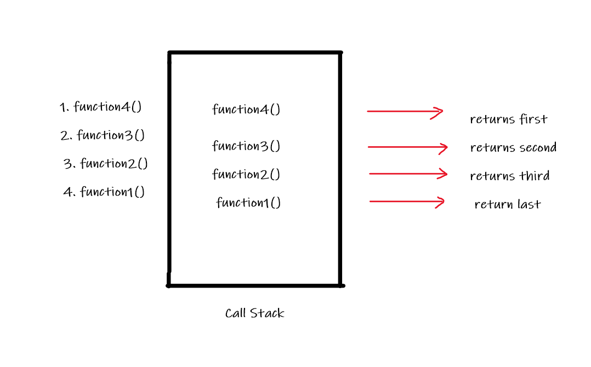

# Read10: In memory storage

## Understanding the JavaScript Call Stack

- What is a ‘call’?
  A call is an abbreviation for call stack, which is used for function invocation.
  <br/>

- How many ‘calls’ can happen at once?
  call stack is single, which means that the execution of function is one at a time (multiple function can not be executed at the same time)
  <br/>

- What does LIFO mean?
  - A call stack is a data structure that uses the Last In, First Out (LIFO) principle to temporarily store and manage function invocation (call).
  - The Last In, First Out (LIFO) means, that when calling a group of functions, the last function to be called is the first one to return its result.

<br/>

- Draw an example of a call stack and the functions that would need to be invoked to generate that call stack.
  

<br/>

- What causes a Stack Overflow?
  A stack overflow occurs when there is a recursive function (a function that calls itself) without an exit point. The browser (hosting environment) has a maximum stack call that it can accommodate before throwing a stack error
  <br/>

## JavaScript error messages:

** What is a ‘refrence error’? **

This error appears when an undefined variable is used like:

```
let x = 10;

console.log(x + y)

// y is not yet defined
```

<br/>

- What is a ‘syntax error’?
  This error occur when a something is written wrong in the code like:

```
const fun = function {
    return a+b;
}

// it should be:
let fun = function() {
    return a+b;
}
```

<br/>

- What is a ‘range error’?

This error occur when trying to manipulate an object with some kind of length and giving it an invalid length like :

```
let array = [1,2,3,];
array.length = array.length - 4;

// arrays can not have negative length

```

<br/>

- What is a ‘tyep error’?

This error occur when types (number, string and so on) you are trying to use or access are incompatible, like accessing a property in an undefined type of variable.

```
var foo = {}
foo.bar // undefined
foo.bar.baz // Uncaught TypeError: Cannot read property 'baz' of undefined
```

<br/>

- What is a breakpoint? >When ever these errors appears and trying to debug them, the ;ine where the error happens is called **breakpoint**, which breaks your code and make you bang your head against the wall !
  <br/>

- What does the word ‘debugger’ do in your code? >We use in our code the **‘debugger’** to check fo errors, by putting it at the point we want to break. This method will show in steps how each code is run and also, show statistics of the code.
  <br/>

# References:

[Understanding the JavaScript Call Stack](https://medium.freecodecamp.org/understanding-the-javascript-call-stack-861e41ae61d4) <br/>
[JavaScript error messages](https://codeburst.io/javascript-error-messages-debugging-d23f84f0ae7c) <br/>
