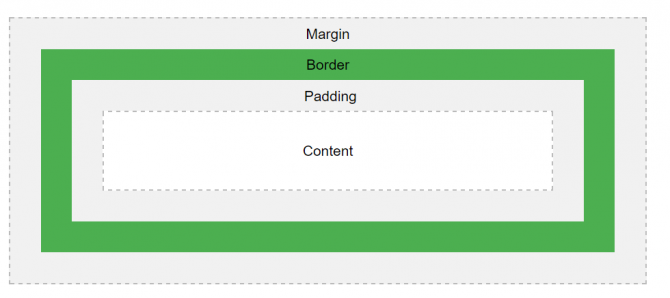

# Read: 03 - HTML Lists, CSS Boxes, JS Control Flow

## Duckett HTML book

### Chapter 3: “Lists” 

##### Types of the lists:
1. **ol** ordered lists which used numbers 
2. **ul** unordered lists which used bullets 
3. **dl** defintion lists which contains the term and the definition 
4. nested lists second list in li element

### Chapter 13: “Boxes” 

- CSS treats HTML elements like has a box around. 
- Boxes parts: 
    - Content like text or images 
    - Padding the area around the content. 
    - Border which goes around the padding and content
    - Margin thw area outside the border.
- Padding and margin are transparent

- We can change border width, style and color.
- display property specifies the display behavior of each element.
- display values could be:
    - inline like span in the same line
    - block starts on new line and takes up the whole width
    - inline-block inline element with height and width values
- visibility property Make elements visible and hidden
- box-shadow property attaches one or more shadows to the element.
- border-radius property defines the radius of the element corners.

## Duckett JS book

### Review from Reading 02 - Chapter 2: “Basic JavaScript Instructions”
 
- Array: It's a special type of variable stores a list of values. 
  example: 

      var studentName; 
      studentNames= ['Ahmad','Khaled','Ali'];

### Chapter 4: “Decisions and Loops”

- If statement: to specify a block of JavaScript code to be executed if a condition is true.
- else statement: o specify a block of code to be executed if the condition is false.
- The switch statement executes a block of code depending on different cases.
- Loops used to run the code with a different value.
    - for loops run a code for number of times
    - while run the code as long as the condition is true.
    - do/while run the code then check if the condition is true then repeat the loop.
- do-while example:

    let i = 1;
    const n = 5;
    do {
        console.log(i);
        i++;
    } while(i <= n);