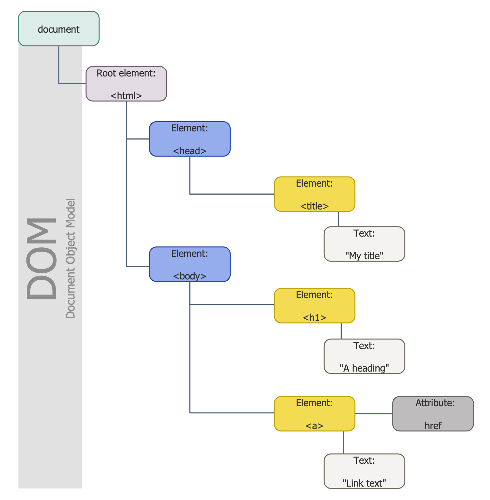

# Read: 06 - JS Object Literals; The DOM

## Duckett JS book

### Chapter 3: “Object Literals” 

##### WHAT is an object? 
- a series of variables and functions that represent something 
- In the object the variables are known as properties and the functions are known as methods. 
- We can access the pobject properties in two ways:
      1. Dotnotation
      2. Bracketnotation

````````````````
  var user = {
     firstName: "Nawal",
     lastName: "Ahmad",
     dateOfBirth: 1991  
  };
  console.log(user.firstName); //dotnotation
  console.log(user[firstName]); // bracketnotation

````````````````

````````````````
var user = {
   firstName: "Nawal",
   lastName: "Ahmad",
   dateOfBirth: 1991,
   getName: function(){
      return "User's name: " + this.firstName + " " + this.lastName;
   }
};
console.log(user.getName());
// User's name: Nawal Ahmad
````````````````
- We can add and delete property:
user.car=BMW, //adding
delete user.lastName //deleting


### Chapter 5: “Document Object Model”

- The dom tree is a model of a web page

- DOM trees have four types of nodes:
   - document nodes represent the entire HTML page
   - element nodes describe the structure of HTML page
   - attribute nodes
   - text nodes



- Methods that find element in dom tree are called DOM queries.

- Methods that return a single elements:
   - getElementById('id'): method returns the elements with specified tag name, as a NodeList object.
   - querySelector('css selector): method returns the first child element that matches a specified CSS selector(s) of an element.
   - document.getElementById('one')

- Methods that return on or more elements:
   - getElementByClassName('class): Returns a collection of all child elements with the specified class name
   - getElementByTagName('tagName'): Returns a collection of all child elements with the specified tag name
   - querySelectorAll('css selector): 	Returns all child elements that matches a specified CSS selector(s) of an element

- Selecting An elements from a : require the index number of the element you want
   - The item() method
   ``````````
   var elements = document.getElementsByClassName('hot') 
   if (elements.length>= 1) { 
   var firstltem = elements.item(O);  
   } 
   ``````````

   - Array syntax: faster than item() method
   ```````````
     var elements = document.getElementsByClassName('hot') 
   if (elements.length>= 1) { 
   var firstltem = elements[0];  
   } 

- Repeating actions for an entire nodelist: loop through each ode in the collectionand apply the same statement to each.
   ```````````
   var myNodelist = document.querySelectorAll("p");
   var i;
   for (i = 0; i < myNodelist.length; i++) {
   myNodelist[i].style.color = "red";
  }
   ```````````

- Looping Through a nodelist: play-by-play
   ```````````
  for (var i=0; i<hotItems.length;i++){hotitems[i].className='cool';
  }
  ```````````

- Adding or removing HTML content:
   - inner HTML property 
   - DOM manipulation

- Attribute Nodes:use the properties and methods to access and change attributes.

