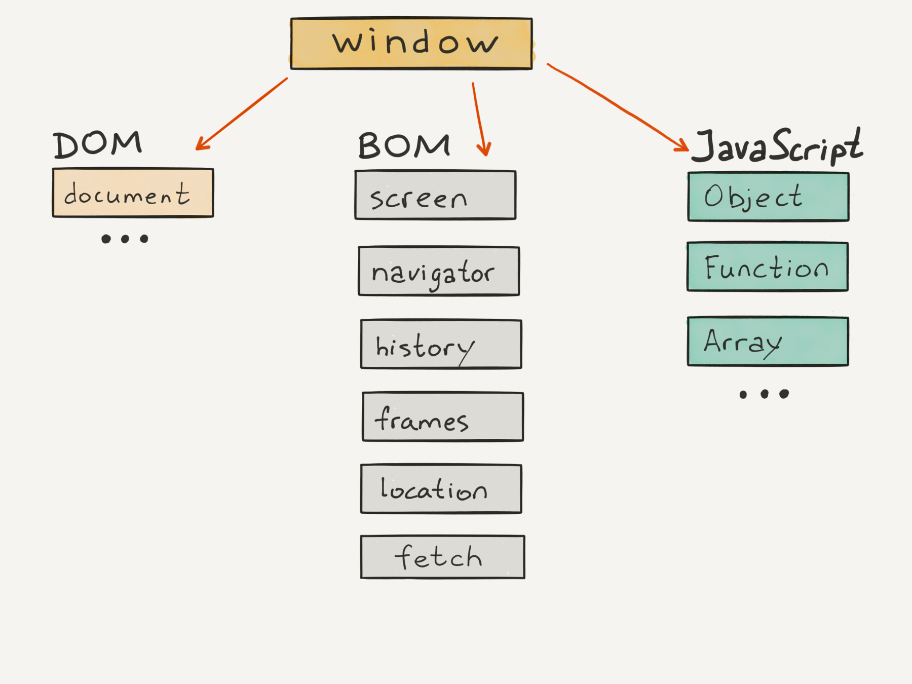
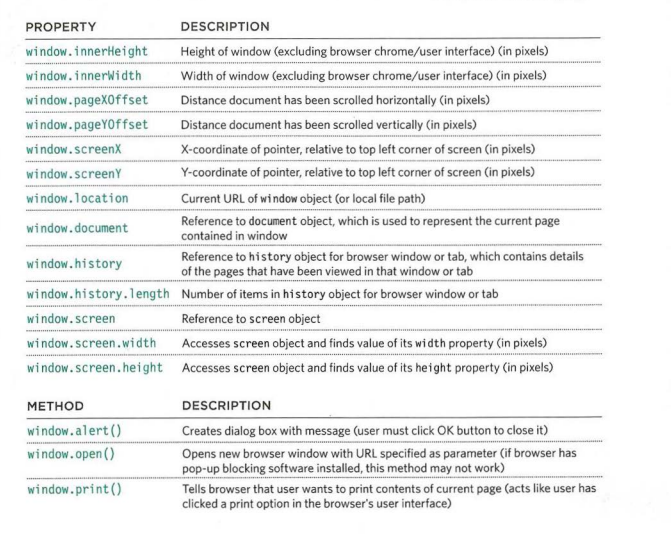
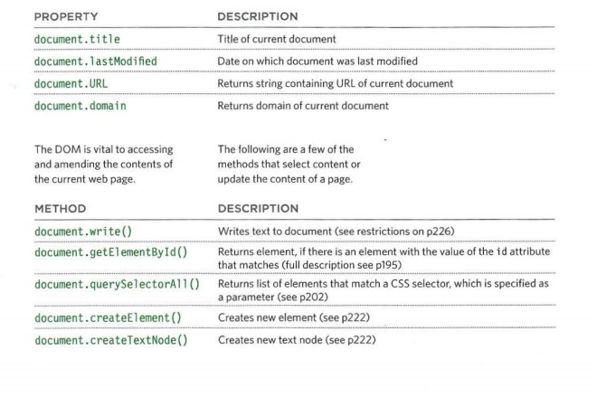
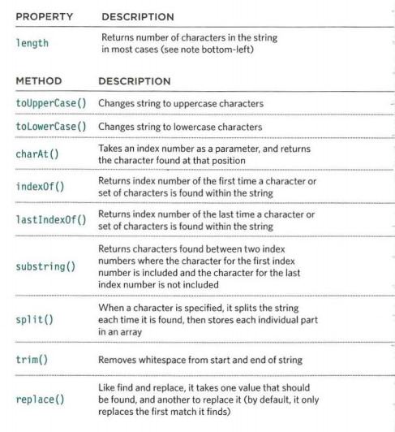
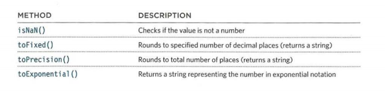
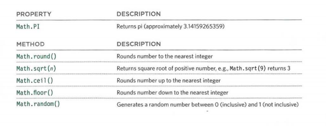
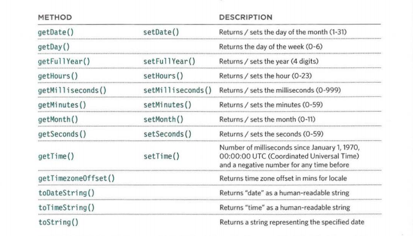

# Read: 07 - HTML Tables; JS Constructor Functions

## Duckett HTML book:

### Chapter 6: “Tables”

- A table represents information in a grid format to arrange data into rows and columns.
- The `<table>` tag defines an HTML table.
- Each table row is defined with a `<tr>`
- Table header is defined with a `<th>` tag
- Each table data/cell is defined with a `<td>` tag.
- Colspan attribute used to make a cell span more than one column.
- rowspan attribute used to make a cell span more than one row.
- `<thead>` Groups the header content in a table
- `<tbody>`	Groups the body content in a table.
- `<tfoot>`	Groups the footer content in a table.
- width attribute used to specify width,Cellpadding specifies the space between the cell content and border, both used in the opening `<table>` tag.
- adding a border and a background color to a table by using the CSS border property.


## Duckett JS Book:

### Chapter 3: “Functions, Methods, and Objects” 

- We can creat and update object by two ways:  
  1. Notation `student.name='Amal';`
  2. square brackets `student['name']='Amal;'`
- to delete a property `delete student.name;`
- to clear value of property `student.name='';`
- Methods are stored in properties as function definitions.
``````````````
var person = {
  firstName: "Nawal",
  lastName : "Ahmad",
  fullName : function() {
    return this.firstName + " " + this.lastName;
  }
};
``````````````
- this.firstName means the firstName property of this object.
- Arrays are used to store a group of objects.
- JavaScript built-in objects:
  - Browser object model (objects that represent the current browser window or tab)
  - Document object model (objects to represent the current page)
  - Global JavaScript objects 


- The browser object model:


- The document object model:


- Global string object:


- Global number object:


- Global math object:


- Global date object:



