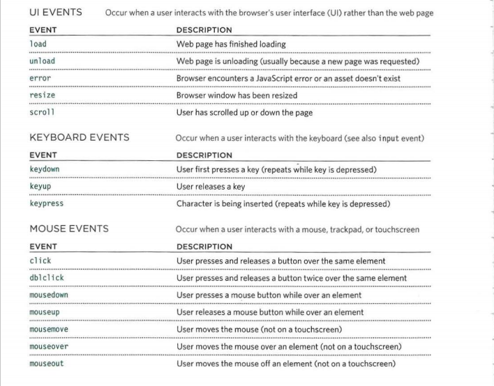
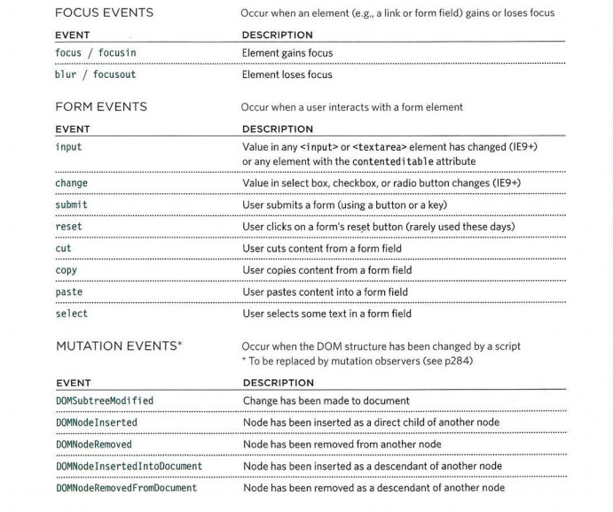

# Read: 09 - Forms and Events

### Chapter 7: “Forms”

- Forms used to collect user input that mostky sent to a server for processing.

- The `<form>` element is a container for different types of input elements, such as: text fields, checkboxes, radio buttons, submit buttons.

- The `<input>` element is the most used, it's could displayed in many ways depends on the type of attributr.

- use type attribute to select the type of the data that users will insert. 

- .jpg)

### Chapter 14: “Lists, Tables & Forms” 

- For styling tables, We have many CSS attributes to apply: like table border, table width, background colors and font colors.

- CSS list properties allow us to:  
  - Set different list item markers for ordered lists and unordered lists.
  - Set an image as the list item marker
  - Add background colors to lists and list items

### Chapter 6: “Events” 

- An HTML event can be something the browser or the user does.

- some examples of HTML events:
  - when HTML web page has finished loading
  - when HTML input field changed
  - HTML button was clicked

- JavaScript lets development execute code when events are detected.

- HTML allows event handler attributes, with JavaScript code, to be added to HTML elements.

- Events Example
  - 
  - 

#### How event trigger JavaScript code:
1. select the element.
2. Indicate the event.
3. State the code that will run.

##### References :
* HTML & CSS: Design and Built Websites.JON DUCKETT.
* Interactive Front-End Development. JON DUCKETT.