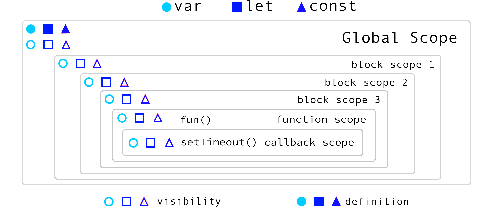
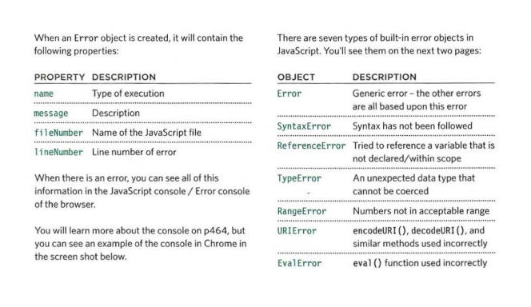

# Read: 10 - JS Debugging

- The console and dev tools are built into the browser help to find error.
- To find the source of error we could :
  1. Order of execution by following the code statements
  2. Excution context: statements in code are one of:
    - Globalcontext: out of functions
    - Function context: run within function
    - Eval context: like the text before function 

- The stack is when the statement needs data from another function, that function should be on the top.

- There are two phases of activity each time a script enters a new exection :prepare and excute

- Understanding scope




- Understanding Errors
When JavaScript statement generates an error,  the interpreter stops and looks for exception-handling code.


- Error objects




* Reference Error: caused by variable that is not decalare or used out of the scope.
* Range Error: it's happened when used number outside of the aacepted rangr.
* Type Error: it's caused by trying to use function and object that aren't exist.
* Syntax Error: it's happened when programmer hasn't follow the programm language rules.
* NAN: when mathmatical operation using value isn't a number.

#### How to deal with error?
1. Debug and track the script to fix error
2. Handle error gracefully. try, catch, throw and finally statements

- Searching for errors and fixing them in programming code is called code debugging.

#### How could we determine where is exactly the problem?
1. look at the error message.
2. check how the script running.
3. use breakpoints when you are not sure.

#### What is exactly the problem?
1. check if the variables have a values around the breakpoints(places where code execution can be stopped)
2. break out parts of the code to smaller pieces.
3. check the number of parameters for functions and array items numbers.

- At each breakpoint JavaScript stop executing to examine the code.

- JavaScript try and catch

  - try statement: allows to define a block of code to be tested for errors while it is being executed.
  - The catch statement: allows to define a block of code to be executed if an error occurs in the try block.
  - The finally statement: execute code after try and catch regardless of the result.

  ````````````````````````
  try {
  Block of code to try
  }
  catch(err) {
  Block of code to handle errors
  } 
  finally {
  Block of code to be executed regardless of the try/ catch result
  }
  ````````````````````````

- JavaScript Throws Errors
  - When error occurs JavaScript stop and generate error message (throw an error).
  - throw statement used to create a custom error.
  
  `````````````````````````
  throw "Hello World";    // throw a text
  throw 450;              // throw a number
  `````````````````````````


